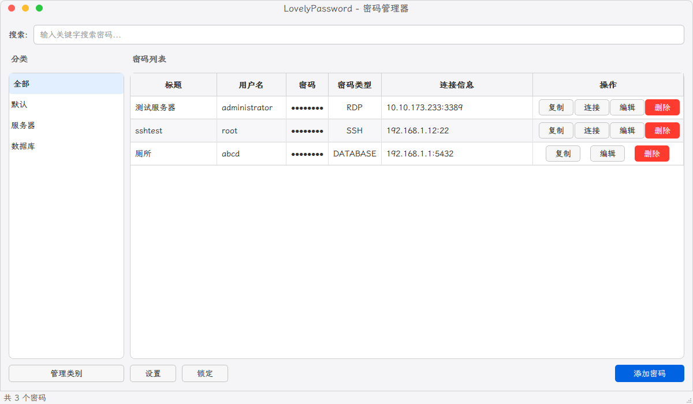

<div align="center">
  
  <h1>LovelyPassword</h1>
  <p>自用密码管理工具</p>
  <p>
    <a href="#功能特性">功能特性</a> •
    <a href="#安全特性">安全特性</a> •
    <a href="#技术栈">技术栈</a> •
    <a href="#快速开始">快速开始</a> •
    <a href="#使用说明">使用说明</a>
  </p>
  
</div>

## ✨ 最新功能

- **密码类型显示**：在密码表格中直观显示密码类型（RDP、SSH或普通密码）
- **MobaXterm集成**：支持通过MobaXterm连接SSH服务器，提供更好的终端体验
- **智能端口选择**：内置常见数据库和服务的端口选项，同时支持自定义端口
- **优化界面布局**：调整表格列宽，提供更合理的显示效果
- **自动加载密码**：窗口显示时自动加载密码列表，提升用户体验

## 🔑 功能特性

<table>
  <tr>
    <td width="33%">
      <h3 align="center"><i>🔒</i><br>加密存储</h3>
      <p align="center">使用高级加密技术保护您的密码数据，只有您知道主密码</p>
    </td>
    <td width="33%">
      <h3 align="center"><i>🖥️</i><br>远程连接</h3>
      <p align="center">支持SSH和RDP连接，一键连接到您的服务器</p>
    </td>
    <td width="33%">
      <h3 align="center"><i>🔍</i><br>快速搜索</h3>
      <p align="center">轻松查找和筛选您的密码，按类别或关键词搜索</p>
    </td>
  </tr>
  <tr>
    <td width="33%">
      <h3 align="center"><i>🗃️</i><br>分类管理</h3>
      <p align="center">将密码按类别整理，方便查找和管理</p>
    </td>
    <td width="33%">
      <h3 align="center"><i>🔄</i><br>密码生成器</h3>
      <p align="center">生成强密码，提高您的账户安全性</p>
    </td>
    <td width="33%">
      <h3 align="center"><i>🌐</i><br>数据库连接</h3>
      <p align="center">内置常见数据库端口，支持MySQL、PostgreSQL等多种数据库</p>
    </td>
  </tr>
</table>

## 🛡️ 安全特性

- **本地加密**：所有数据在本地加密存储，不会上传到云端
- **主密码保护**：使用强大的主密码保护您的密码库
- **自动锁定**：闲置时自动锁定应用程序，防止未授权访问
- **安全剪贴板**：复制密码到剪贴板后自动清除，防止信息泄露

## 🔧 技术栈

- **Python 3.8+**：核心编程语言
- **PySide6**：现代化GUI框架
- **SQLite**：轻量级数据存储
- **Cryptography**：强大的加密库
- **Paramiko**：SSH连接支持
- **MobaXterm**：高级SSH终端支持

## 📦 项目结构

```
LovelyPassword/
├── src/
│   ├── __init__.py
│   ├── main.py              # 应用程序入口
│   ├── models/              # 数据模型
│   │   ├── __init__.py
│   │   ├── password.py      # 密码数据模型
│   │   └── category.py      # 分类数据模型
│   ├── views/               # 视图组件
│   │   ├── __init__.py
│   │   ├── main_window.py   # 主窗口
│   │   └── dialogs/         # 对话框
│   ├── controllers/         # 控制器
│   │   └── password_manager.py
│   └── utils/              # 工具函数
│       ├── encryption.py    # 加密相关
│       ├── connection.py    # 连接工具
│       └── connection_templates.py # 连接模板
├── resources/              # 资源文件
│   ├── icons/
│   └── styles/
└── README.md              # 项目文档
```

## 🚀 快速开始

### 安装依赖

```bash
pip install -r requirements.txt
```

### 运行应用

```bash
python run.py
```

## 📖 使用说明

### 首次使用
1. 运行应用程序，设置主密码
2. 创建密码分类
3. 添加您的第一个密码

### 连接到远程服务器
1. 选择带有连接信息的密码条目
2. 点击"连接"按钮
3. 对于SSH连接，将优先使用MobaXterm（如果已安装）
4. 对于RDP连接，将使用内置的RDP客户端

### 管理数据库连接
1. 添加新密码时选择"数据库连接"类型
2. 从下拉菜单选择常见的数据库端口，或输入自定义端口
3. 填写必要的连接信息
